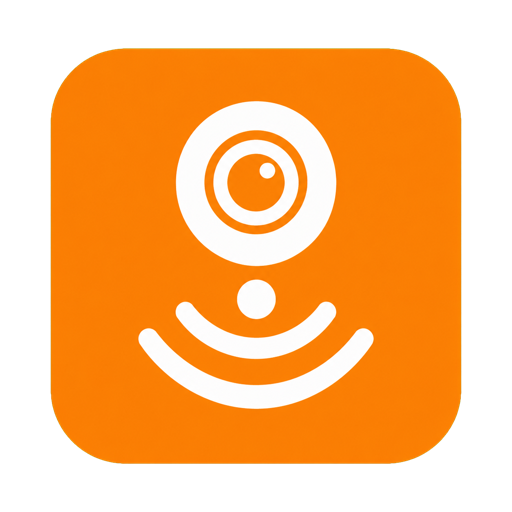

# Imou Direct

  

Experimental HACS custom integration that exposes an Imou Doorbell 3 as a
normal Home Assistant `camera` entity without Android at runtime.

The recovered stream path:

- provides an interactive Home Assistant login and device picker;
- opens the camera's authenticated LAN channel over the recovered PTCP/DHHTTP
  transport, without captured request data;
- can fall back to a signed Imou media transfer when the local path is
  unavailable;
- constructs a fresh proprietary TLS/WSSE `PLAY` handshake for either path;
- reconstructs RTP/DHAV frames and decrypts encrypted HEVC keyframes;
- converts HEVC to H.264 HLS and a JPEG snapshot with FFmpeg; and
- hands the result to Home Assistant's authenticated camera/stream proxy.

This is a research prototype for hardware and accounts you own or are
authorized to test. It is currently validated with an Imou Doorbell 3 plus
Chime.

## Account setup and private data

Setup asks for the Imou account, password, two-letter account country, camera
name, and output width in the normal Home Assistant interface. If the account
contains multiple supported cameras, a second screen asks which one to add.

The account identifier and account password are used only for that login and
are not stored. Home Assistant stores the resulting Imou session token and
device stream credentials locally in its config-entry storage so it can
reconnect after a restart. Treat the Home Assistant configuration directory
and backups as sensitive. These values are excluded from diagnostics and logs.

Use **Reconfigure** on the integration if the private Imou session expires or
you want to refresh its device credentials. This asks for the account login
again and replaces the old session without storing the account password.

Existing version 0.1 installations that use `/config/imou_direct.json` remain
compatible. Reconfiguring such an entry migrates it to the interactive,
file-free setup.

### Network boundary

There is no project-operated backend and no Android relay. Login and device
discovery still contact Imou directly during initial setup and **Reconfigure**.
At runtime, version 0.3 can receive video directly from the device on the LAN.
Video decoding, snapshots, HLS generation, and Home Assistant delivery all
happen locally.

The setup form offers three transport modes:

- **Local first, with cloud fallback** (default) tries the LAN transport and
  requests a temporary Imou transfer only if the local connection fails.
- **Local only** never calls the Imou media-transfer service at runtime. This
  mode continues to work without WAN access after a successful setup, provided
  Home Assistant and the camera remain on the same LAN.
- **Cloud only** retains the version 0.2 runtime behavior.

Existing version 0.2 entries do not yet contain the additional LAN credentials.
Use **Reconfigure** once after upgrading to populate them; until then the
default mode safely uses its cloud fallback.

For the complete recovered sequence—from XAPK/JADX and native/runtime analysis
through PCS bootstrap, LAN PTCP/DHHTTP, `PLAY`, RTP/DHAV decryption, FFmpeg, and
Home Assistant delivery—see [Technical stream flow](docs/TECHNICAL_FLOW.md).

## Install with HACS

1. In HACS, open **Custom repositories**.
2. Add `https://github.com/skeltavik/imou-direct` as category
   **Integration**.
3. Install **Imou Direct** and restart Home Assistant.
4. Open **Settings → Devices & services → Add integration**.
5. Select **Imou Direct**, enter the Imou login in Home Assistant, and select
   the camera when prompted.

For manual installation, copy `custom_components/imou_direct` into
`/config/custom_components/imou_direct` and restart Home Assistant.

Home Assistant OS and Home Assistant Container already include FFmpeg, so no
separate add-on or setup field is needed. Other installation types must provide
an `ffmpeg` executable on Home Assistant's `PATH`.

## Security and runtime behavior

- The generated HLS service binds only to `127.0.0.1` inside Home Assistant.
- The Imou account identifier and password are never retained after setup.
- Session and device credentials remain in Home Assistant's local config-entry
  storage and never appear in diagnostics or entity attributes.
- Browser clients use Home Assistant's authenticated camera proxy.
- Diagnostics contain only connection state, frame age, and reconnect count.
- Temporary HLS segments and snapshots are deleted when the integration unloads.
- No Android process, Supervisor add-on, open add-on port, Generic Camera entry,
  RTSP server, or ONVIF profile is required at runtime.
- In **Local only** mode, opening and reconnecting the stream performs no Imou
  cloud media request.

## Compatibility

- Home Assistant 2025.3 or newer
- HACS integration repository layout
- FFmpeg with `libx264`
- Currently tested: Imou Doorbell 3 HEVC stream at 2304×1296, transcoded to a
  configurable H.264 width (960 pixels by default)

Home Assistant 2026.3 and newer load the bundled integration icon locally.
Imou is a trademark of its respective owner. Imou Direct is an independent,
unofficial interoperability project and is not affiliated with or endorsed by
Imou.
