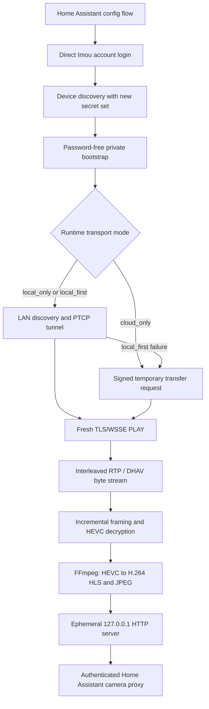
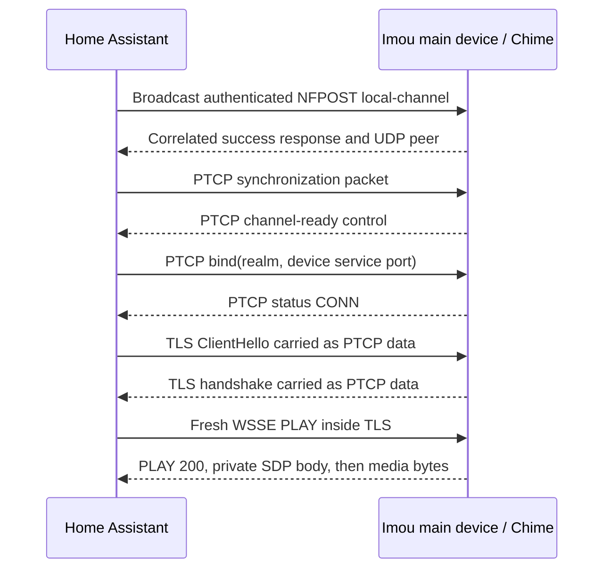
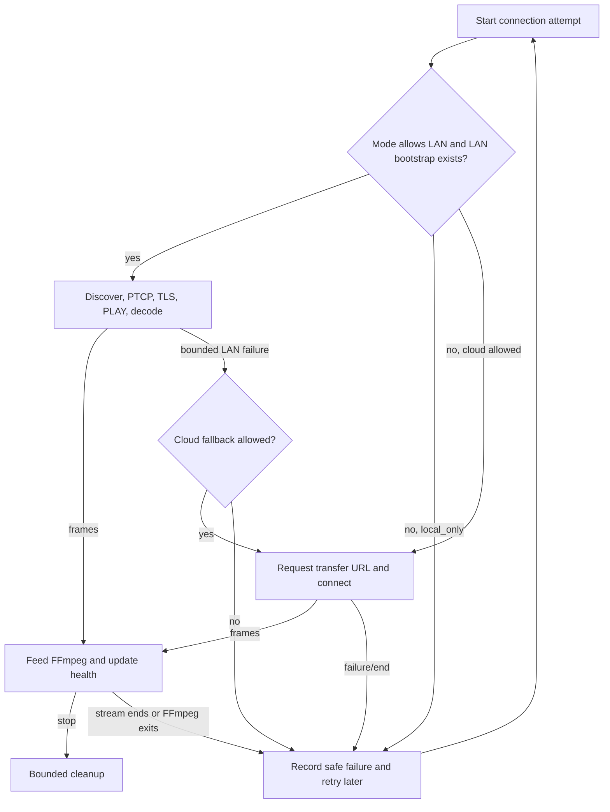

# Imou Direct: reverse-engineered stream flow

This document describes how Imou Direct reaches an authorized Imou Doorbell 3
stream, which parts were recovered from Imou Life 10.1.6, and how the current
Home Assistant integration reimplements the sequence without Android at
runtime.

It deliberately omits device identifiers, addresses, credentials, tokens,
captured payloads, and decompiled vendor code. Field names and protocol shapes
are included only where they are needed to explain interoperability.

## Status and scope

The current implementation supports an Imou Doorbell 3 paired with its Chime.
It has three runtime transport modes:

- `local_first`: try the recovered LAN P2P path, then use the cloud transfer
  path if the LAN attempt fails or produces no decodable video;
- `local_only`: use the LAN path and never request an Imou media-transfer URL at
  runtime; and
- `cloud_only`: always request a temporary Imou media-transfer URL.

Initial setup and **Reconfigure** are not offline. They sign in directly to
Imou to discover the authorized device and obtain the current session and
device-secret material. The account identifier and password are transient and
are not stored. The resulting session and device credentials are stored in the
Home Assistant config entry and must be treated as secrets.

The validated media contract is encrypted HEVC input, H.264 HLS output, and a
JPEG snapshot. Audio is currently discarded. Other Imou products, firmware
versions, and channel layouts may use different branches of the vendor SDK and
must not be assumed compatible.

## End-to-end architecture



The two transports converge before media parsing. Once a successful `PLAY`
response has been consumed, the RTP/DHAV extractor, frame-key rules, FFmpeg
pipeline, camera entity, health reporting, and cleanup behavior are shared.

## How the route was recovered

### 1. LAN and ONVIF probing

Authorized probing established that the device exposes an ONVIF service and
can temporarily expose an authenticated RTSP-over-TLS listener while live view
is active. Those facts did not yield a usable standard camera route:

- ONVIF authentication succeeded, but `GetProfiles` returned no media
  profiles;
- the temporary RTSP listener accepted authentication and `OPTIONS`;
- generic Dahua, ONVIF, and common camera `DESCRIBE` paths returned no usable
  stream; and
- disabling TLS could not create the missing media profile or resource.

This ruled out a simple static `rtsp://` URL or normal Home Assistant ONVIF
integration for the tested Doorbell/Chime combination.

### 2. XAPK, JADX, and native-library analysis

Imou Life 10.1.6 was unpacked from its XAPK. The base APK was decompiled with
JADX, and its arm64 libraries were inspected for strings, exports, JNI
boundaries, and call relationships. Some Java methods were heavily obfuscated,
so conclusions were based on multiple matching sources rather than one
decompiler rendering.

The recovered application flow showed:

1. live view prefers a vendor P2P task;
2. the native SDK creates a session and exposes a phone-local proxy port;
3. Java builds a loopback media URL containing main-device and bound-child
   fields; and
4. only when P2P is unavailable or bypassed does the app ask Imou for a
   temporary backend transfer resource.

The native boundary contained the P2P transport, DHHTTP client, proprietary
stream parsing, decryption, and decoder integration. The app could also enable
an encoded-stream callback after the proprietary layer, confirming that valid
HEVC media existed behind the SDK rather than at a standard camera URL.

### 3. Runtime correlation

Runtime instrumentation on an authorized account correlated four views of the
same live session:

- Java-side source selection and URL construction;
- native P2P and encoded-stream callbacks;
- network traffic between the Android process, Chime, and Imou services; and
- plaintext immediately before/after the proprietary TLS and media layers.

This established that the tested model selected a DHHTTP `.xav` path carried
through a LAN P2P tunnel. It also exposed the child-binding parameters, the
cloud transfer fallback, the `PLAY` handshake, RTP payload type, DHAV framing,
encrypted keyframe metadata, and the frame-key inputs.

Captured dynamic values were used only to understand relationships. The
published integration regenerates dates, nonces, request IDs, signatures,
digests, session fields, and requests. It does not replay a captured `PLAY`
packet or ship any capture.

### 4. Capture-free reconstruction

Each recovered layer was then replaced with a small implementation and tested
independently:

- PCS request canonicalization and dual signatures;
- interactive login, device discovery, and credential decryption;
- capture-free WSSE `PLAY` construction;
- incremental RTP and DHAV extraction across arbitrary TCP/UDP boundaries;
- frame-key derivation and partial AES decryption;
- LAN discovery, PTCP sequencing, realm binding, and TLS-over-PTCP; and
- transport selection, fallback, transcoding, loopback serving, and cleanup.

The result is a Python Home Assistant custom integration. No APK, Android VM,
JNI library, Android relay, or vendor native library is used at runtime.

## Phase A: setup and private bootstrap

### A1. Home Assistant config flow

The config flow collects:

- a display name;
- the Imou account and password;
- the two-letter account country;
- the transport mode; and
- the desired H.264 output width.

Login, discovery, and FFmpeg checks run in Home Assistant's executor because
they perform blocking work. The account and password live only in the config
flow call. They are not written into the config entry, diagnostics, entity
attributes, logs, or test fixtures.

### A2. PCS account login

The integration reproduces the Imou PCS signing contract used by the app:

1. compact UTF-8 JSON is serialized with non-ASCII characters preserved;
2. both MD5 and SHA-256 content digests are calculated;
3. two canonical request strings are built with exact lowercase header names,
   ordering, casing, newline placement, and a trailing newline;
4. each canonical string is signed with HMAC-SHA-256 using the corresponding
   login or token key; and
5. a fresh UTC date, nonce, and signature set is generated per request.

MD5 is present because it is required by the wire protocol, not because it is
recommended for new authentication designs.

The sequence is:

```text
user.account.GetToken
  -> password-derived MD5 and SHA-256 login keys
  -> token username, token, session ID, user ID, regional API host

user.account.Login
  -> token-signed session
```

If the service answers once with HTTP 412 and a server date, the client repeats
the request exactly once using that date. This handles clock disagreement
without creating an unbounded retry loop.

### A3. Device discovery and child/main-device mapping

`device.list.DeviceBasicInfoQueryV2` is requested with `needNewSecret=true`.
For every candidate device, the integration finds its media configuration and
extracts the minimum data needed by the two runtime transports.

For a Doorbell/Chime binding, two identities matter:

- the **main device** owns the LAN P2P session and its media account; and
- the **bound child** selects the doorbell channel inside that session.

The related-device structure supplies this mapping. Treating the child fields
as optional decoration produces the wrong stream even when a generic channel
URL looks plausible.

New-format media credentials are AES-GCM values. Their per-device key is:

```text
SHA-256(device_identifier || "ENCRYPTKEY")
```

The encoded payload supplies a 12-byte nonce followed by ciphertext and its
authentication tag. Decryption failure aborts that device candidate; it does
not fall back to logging or retaining the opaque vendor response.

### A4. Stored bootstrap

The password-free bootstrap contains three private sections:

| Section | Purpose |
|---|---|
| `rest` | token-backed PCS host and signing material for cloud transfer |
| `request` | selected device/channel and stream parameters |
| `stream` | media account, media password, WSSE input, and device identity |
| `lan` | main/child mapping, P2P endpoint parameters, and P2P secret set |

The complete bootstrap is secret. Even apparently harmless identifiers can
become sensitive when combined with the session and device credentials.

## Phase B: runtime transport selection

The background worker constructs a fresh candidate list for every connection
attempt:

```text
local_only  -> local
local_first -> local, then cloud
cloud_only  -> cloud
```

An upgraded v0.2 entry may not yet have the `lan` section. In `local_first`, it
uses the cloud candidate until **Reconfigure** refreshes the bootstrap. In
`local_only`, missing LAN data is an error and cannot silently become a cloud
call.

Local fallback is triggered not only by connection errors. If the LAN
transport returns bytes but no complete video frame is decoded within the
bounded frame timeout, it is treated as failed. This prevents a half-open P2P
session from blocking `local_first` forever.

## Phase C: local LAN P2P transport

### C1. Authenticated local-channel discovery

The LAN transport opens one UDP socket, enables broadcast, and sends an
authenticated `NFPOST` local-channel request to the Imou discovery service on
UDP port 28591. The default destination is the LAN broadcast address; test and
diagnostic configurations can inject a narrower destination.

Every request regenerates:

- body nonce;
- WSSE nonce;
- UTC creation times;
- random salt;
- request ID; and
- CSeq correlation value.

The device authentication value is derived from the device media username,
password, random salt, nonce, and creation time. The outer WSSE digest uses the
P2P access-key identity and P2P secret. Only a response with the matching CSeq
and a success status becomes the P2P peer.

Discovery is bounded to three attempts and observes the manager's stop event.

### C2. PTCP framing

The discovered UDP peer speaks a reliable, connection-like framing protocol
whose packets begin with `PTCP`. The recovered header carries:

```text
magic | sent-byte counter | received-byte counter | packet ID
      | local packet ID | remote packet ID | body
```

The implementation maintains counters and peer IDs, acknowledges body-bearing
packets, and suppresses exact duplicates using bounded fingerprints. It does
not assume that UDP datagrams, PTCP payloads, TLS records, or media frames have
matching boundaries.

The session sequence is:



A random realm identifies the bound logical connection. `CONN` starts the TLS
handshake; `DISC` ends the session. Idle keepalives, connection deadlines,
`PLAY` deadlines, stream timeouts, and the stop event bound every loop.

### C3. TLS over PTCP

Python's `ssl.MemoryBIO` is used because the TLS byte stream is not on a TCP
socket. Outgoing TLS records are wrapped in PTCP data messages; accepted PTCP
data is written into the input BIO. The code repeatedly drives the handshake,
flushes pending records, and drains plaintext without assuming record-sized
reads.

Certificate and hostname verification are disabled only for this proprietary
device/media TLS hop. The tested endpoint presents a vendor/device certificate
that is unsuitable for normal public PKI validation. PCS account and transfer
API HTTPS requests retain normal verification.

### C4. Bound-child DHHTTP resource

The local media target is a loopback-style DHHTTP resource from the vendor
protocol. Its query carries:

- the bound channel (with the recovered one-based adjustment);
- stream subtype;
- encryption mode;
- image-size selector;
- bound child device identity; and
- audio type.

Depending on the media capability, the implementation selects the recovered
visual-talk or real-monitor `.xav` resource. The loopback host in this URL is a
protocol value inside the P2P tunnel; it is not an HTTP server exposed by Home
Assistant.

## Phase D: cloud transfer transport

The cloud candidate uses the same token-backed bootstrap but makes a signed
`things.media.GetRealTransferStreamUrl` request. It supplies the selected
device, channel, stream, encryption, and product parameters. The response is
searched for the temporary TLS `.rtpxav` resource rather than assuming one
fixed response nesting.

The returned host, port, path, and query are server-generated and short-lived.
The integration preserves them and appends the verified `trackID=31` and
`method=0` parameters exactly once. A static URL copied from a capture is not a
working or safe replacement for this step.

In `local_only`, this function is never selected. In `local_first`, it is
selected only after the local candidate raises a bounded LAN failure.

## Phase E: capture-free `PLAY`

Both transports use the same generic `PLAY` builder. It derives fresh
authentication material from the media account, password, device/WSSE key,
nonce, and timestamp. It creates both the legacy SHA-1 password digest and the
SHA-256 `LightweightDigest` expected by the endpoint.

The request contains a private SDP body describing the accepted tracks. Wire
compatibility depends on details that look cosmetic:

- the observed `Accpet-Sdp` spelling is intentional;
- `Private-Length` is the byte length of the private SDP body;
- the target path and query must come from the selected transport;
- WSSE token casing and timestamp format are significant; and
- every nonce and request ID is fresh.

The integration accepts either `Private-Length` or `Content-Length` on a
successful response, consumes that private body incrementally, and sends only
the remaining bytes to the media parser.

Legacy v0.1 bootstraps can still contain a captured-template representation,
but newly discovered and reconfigured devices use the capture-free builder.

## Phase F: RTP, DHAV, and HEVC recovery

### F1. Incremental wire framing

Media arrives in dollar-prefixed interleaved packets. Two length forms were
observed, so the extractor can consume both the normal short length and the
extended form associated with direct DHAV data. It resynchronizes on malformed
or unrelated bytes and caps accepted packet and frame sizes at 8 MiB.

Packets are either:

- a DHAV frame directly; or
- RTP version 2, where payload type 98 carries DHAV bytes.

The RTP parser handles CSRC lists, header extensions, and padding. Other
payload types are ignored. TCP/TLS chunks and RTP packets may contain partial
or multiple DHAV frames, so the DHAV buffer is drained separately.

### F2. DHAV frame validation

A complete DHAV frame is accepted only when:

- the `DHAV` start marker is aligned;
- its little-endian frame length is within bounds;
- its trailing `dhav` marker is present; and
- the repeated trailer length matches.

Only the verified video frame types are emitted. Output begins at a keyframe so
FFmpeg is not fed an undecodable stream tail.

### F3. Frame-key derivation and partial encryption

The media frame key is derived independently for the local or cloud media
account:

```text
credential = username || ":Login to " || effective_key || ":" || password
login_md5  = uppercase_hex(MD5(credential))
frame_key  = PBKDF2-HMAC-SHA256(
               password = login_md5,
               salt = effective_key,
               iterations = 20,000,
               length = 32 bytes)
```

For an encrypted keyframe, the DHAV `0xb5` extension supplies:

- the number of leading clear payload bytes;
- the number of encrypted bytes; and
- a 16-byte IV.

Only that declared encrypted range is decrypted with AES-OFB. The rest of the
HEVC access unit remains untouched. Bounds are checked before decryption; an
impossible range is a protocol error rather than an allocation or truncation
hint.

The output of this phase is raw HEVC access-unit data. Proprietary packet
headers, RTP, DHAV, and encryption metadata are no longer present.

## Phase G: Home Assistant media delivery

The worker starts FFmpeg with raw HEVC on standard input at the validated
15-fps cadence. FFmpeg:

- discards audio;
- splits video into an HLS and snapshot branch;
- scales to the configured width while preserving an even aspect ratio;
- encodes H.264 with low-latency `libx264` settings;
- maintains a short rolling HLS playlist; and
- refreshes one JPEG snapshot approximately every five seconds.

A standard-library HTTP server binds to `127.0.0.1` on an ephemeral port. It
serves only:

- `stream.m3u8`;
- `segment-*.ts`;
- `snapshot.jpg`; and
- coarse health data.

The intermediate URL is never advertised to the LAN. Home Assistant consumes
it internally and exposes the camera through its authenticated camera/stream
proxy. Diagnostics and entity attributes contain only connection state, frame
age, and reconnect count.

On reconnect, old playlists and segments are removed before a new FFmpeg
process starts. On unload, the stop event is set, the process is terminated
with a bounded kill fallback, threads and the loopback server are stopped, and
the temporary media directory is deleted.

## Failure and fallback behavior



Errors are logged by stable exception type or stage, not by dumping request
headers, URLs, vendor bodies, session data, or decrypted media.

## What “local” means

`local_only` means that runtime media acquisition stays between Home Assistant
and the authorized Imou device on the LAN. It does **not** mean:

- offline first-time setup;
- removal of all vendor-derived credentials;
- a standard ONVIF or RTSP route;
- an unauthenticated camera endpoint; or
- permanent operation after credentials, firmware, or device pairing changes.

After a successful setup, the intended WAN-blocked sequence is:

```text
stored password-free bootstrap
  -> LAN broadcast discovery
  -> authenticated PTCP session
  -> TLS/WSSE PLAY through the LAN tunnel
  -> DHAV/HEVC recovery
  -> local FFmpeg/HLS
  -> Home Assistant camera proxy
```

No media-transfer API call exists in this candidate list. A future credential
rotation may still require temporary WAN access for **Reconfigure**.

## Verification map

The tracked test suite uses synthetic data and Home Assistant stubs; no live
credentials or captures are committed.

| Boundary | Evidence in the repository |
|---|---|
| PCS canonicalization, login errors, date retry | `tests/test_cloud.py` |
| AES-GCM credential recovery and bootstrap privacy | `tests/test_bootstrap.py` |
| Config-flow lifecycle and non-storage of account login | `tests/test_config_flow.py` |
| Capture-free `PLAY`, incremental RTP/DHAV, decryption boundaries | `tests/test_core.py` |
| Local request, URL, PTCP framing, response parsing | `tests/test_lan.py` |
| `local_only`, `local_first` fallback, no-frame fallback, `cloud_only` | `tests/test_manager.py` |

Offline tests prove deterministic protocol construction and lifecycle behavior;
they do not by themselves prove a live stream. End-to-end validation requires
a fresh authorized device session, continuous decoded frames, non-empty HLS
and snapshot output, and clean shutdown. The final independence test additionally
requires `local_only` to keep producing media while WAN access is blocked but
LAN access remains available.

## Current limitations

- First-time setup and credential refresh still require Imou's PCS service.
- Only the tested Doorbell 3 plus Chime relationship is in scope.
- LAN broadcast discovery may not cross VLANs or Wi-Fi client isolation.
- Audio, talkback, events, button presses, and PTZ are not exposed.
- No usable standard ONVIF media profile or static RTSP route was verified.
- The device/media TLS exception is specific to proprietary endpoints and must
  not be generalized to normal HTTPS traffic.
- Vendor protocol or firmware changes can require renewed authorized research.

## Source map

| Module | Responsibility |
|---|---|
| `config_flow.py` | transient login, device choice, mode, reconfigure |
| `cloud.py` | PCS signing, token session, device discovery |
| `bootstrap.py` | secret decryption and main/child bootstrap mapping |
| `lan.py` | local-channel discovery, PTCP, TLS-over-PTCP, local `PLAY` |
| `core.py` | transfer signing, generic `PLAY`, RTP/DHAV, frame decryption |
| `manager.py` | candidate selection, fallback, FFmpeg, reconnect, HTTP, cleanup |
| `camera.py` | Home Assistant camera, stream source, snapshot, safe health |
| `diagnostics.py` | coarse non-sensitive runtime diagnostics |

## Responsible interoperability notes

This work is for hardware and accounts the operator owns or is authorized to
test. It documents how to interoperate with one device family; it is not a
credential-extraction guide and does not provide a path to unrelated devices.

The public repository must never contain account data, device identifiers,
network addresses, P2P secrets, session tokens, captured requests, decrypted
frames, or proprietary binaries. Research artifacts remain local and ignored.

Imou is a third-party trademark. Imou Direct is independent and unofficial.
